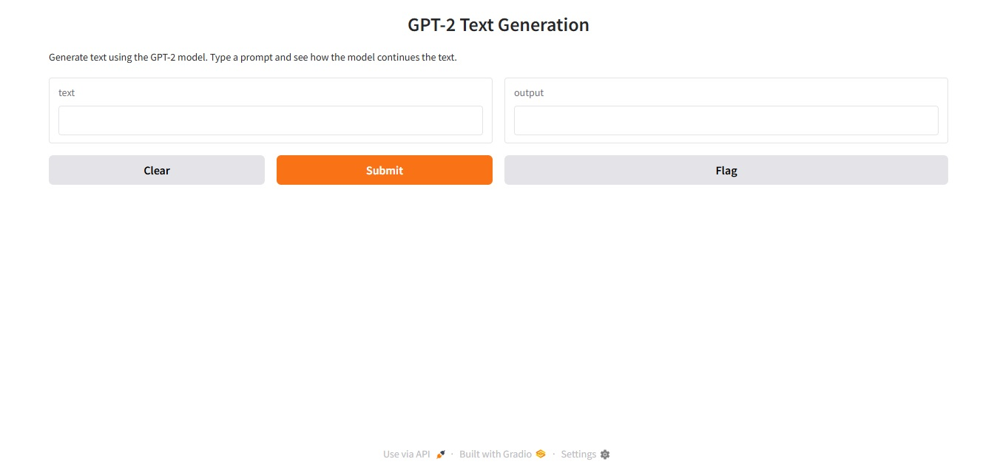

# GPT2-Chatbot
Interactive GPT-2 text generator built with Hugging Face Transformers and Gradio.

# GPT-2 Text Generation with Gradio



This is a simple web app for text generation using the GPT-2 model from Hugging Face Transformers, wrapped in an easy-to-use Gradio interface.

## Features

- Generate text completions based on your input prompt
- Configurable sampling for cleaner and more coherent output
- Interactive and lightweight web UI powered by Gradio

## Requirements

- `transformers==4.55.0`
- `torch==2.8.0`
- `gradio==5.42.0`

You can install the dependencies with:

```bash
pip install transformers==4.55.0 torch==2.8.0 gradio==5.42.0

## How to Run

Clone this repository:

```bash
git clone https://github.com/ugurcandemir/GPT2-Chatbot
cd GPT2-Chatbot

Run the app:

```bash
python main.py

Open the URL shown in your terminal to access the interface.

## Usage

Type a prompt into the input box and the GPT-2 model will generate text continuations for you. Adjust the prompt to explore different outputs.

Feel free to customize or extend this project!

**Note:** This project uses GPT-2, a relatively small language model, so outputs may not always be perfectly coherent.
